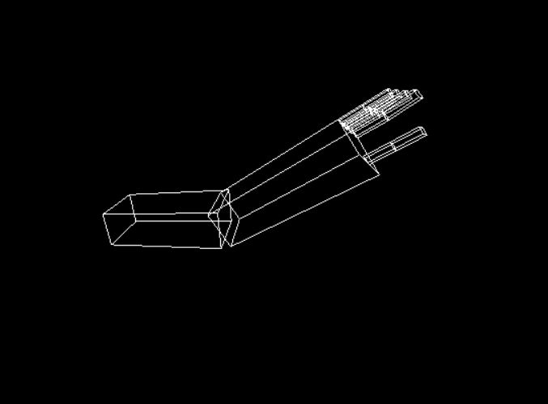
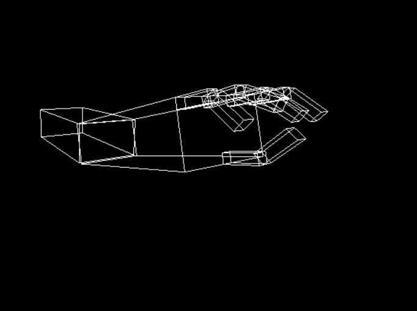

# Robotic Arm
# Description
>  The Robotic arm consists of Shoulder , Elbow and five Fingers 
- The shoulder rotates from 0 to 360 degree .
- The Elbow rotates from  0 to 170 degree.
- Each finger consists of two parts , each part rotates from 0 to 90 degree.

